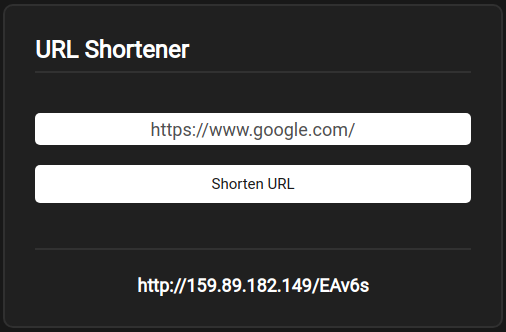

## Hello, I'm Jereb Gainer.

### I'm a longtime hobbiest, working my way towards professional developer.
- I mostly work on backend projects, but I've been studying ReactJS to widen my skillset and get closer to fullstack.
- I've probably put together one-too-many discord bots.
- The reason I started programming was due to my love for modding and making games as a kid.
- I have a strong curiosity as to how libraries and open source software works, so I'm on here a lot to skim projects.

 

### Contact Me:
[][linkedin]
[][github]

 
 
 
 

### Languages and Technologies:

 
 

 
 
 

### Some noteable projects:
- [URL Shortener](https://github.com/MostwantedRBX/urlshortener) that utilizes an SQL database, ReactJS front end, and Golang backend; Deployed on a Linux server.  
[][urlshortener]                

- [ProtonDB Rating Extension](https://github.com/MostwantedRBX/proton-chrome-extension) for Chrome using basic Javascript, CSS, Chrome Events and an API from ProtonDB to display the predicted experience you'll have running the game on Linux through Steam's Proton layer.  

- [Discord Bot](https://github.com/MostwantedRBX/panda-discord-bot) written in Golang. I've have several api's working together to provide fun and functionality to Discord servers like crypto tracking, dice games, an image to ascii converter written by me in python that downloads a url and turns it into an ascii art image and more.

[linkedin]: https://www.linkedin.com/in/jereb-gainer-450017218/
[github]: https://www.github.com/MostwantedRBX/
[urlshortener]: https://github.com/MostwantedRBX/urlshortener
